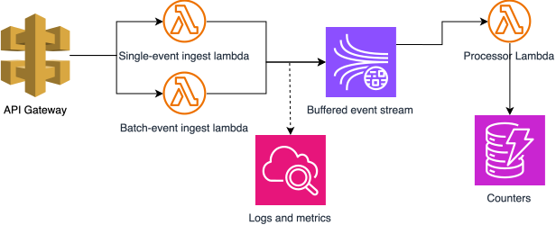

# spool

Minimal Telemetry pipeline

## How does it work?

Spool accepts single or batched events through API Gateway, validates them with ingestion Lambdas, and publishes them to a Kinesis data stream for asynchronous processing. A processor Lambda consumes and aggregates the events into DynamoDB, while CloudWatch captures logs and operational metrics throughout the pipeline.

